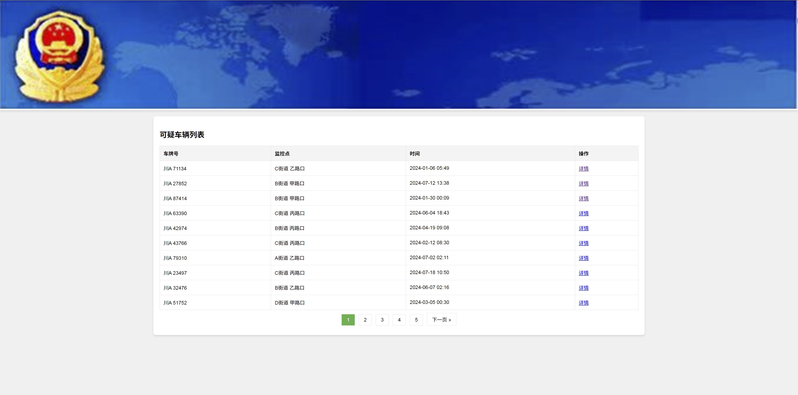
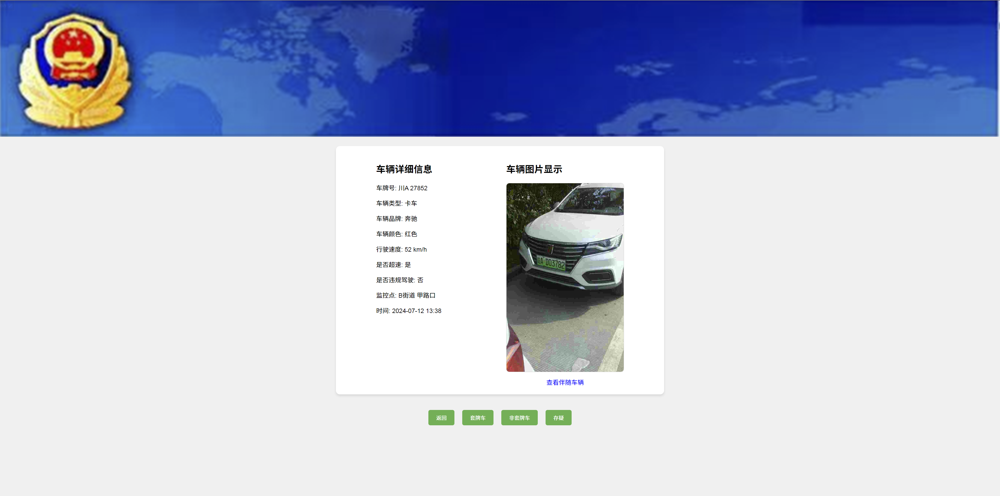
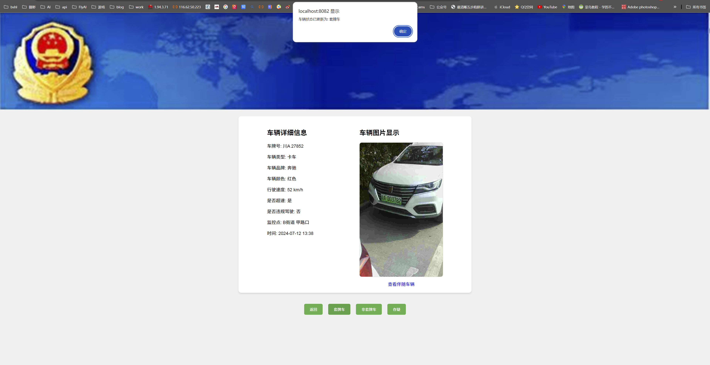
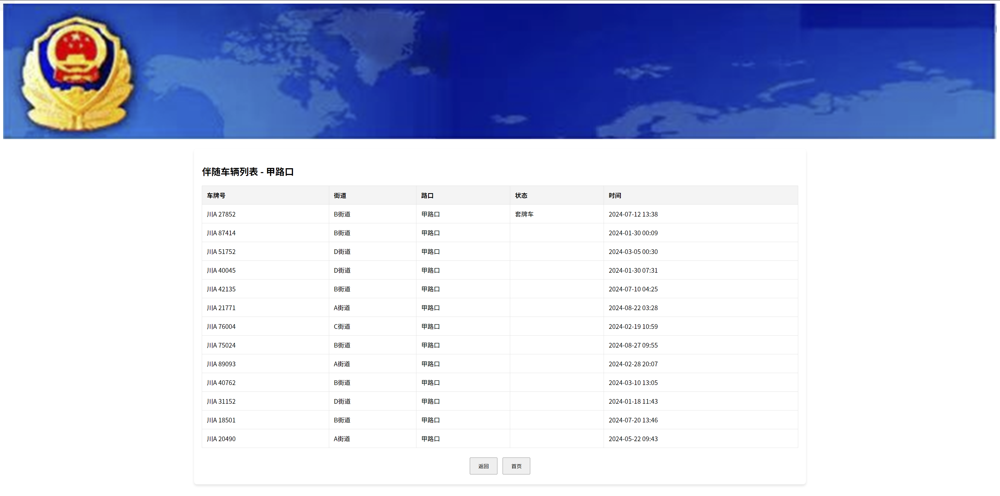
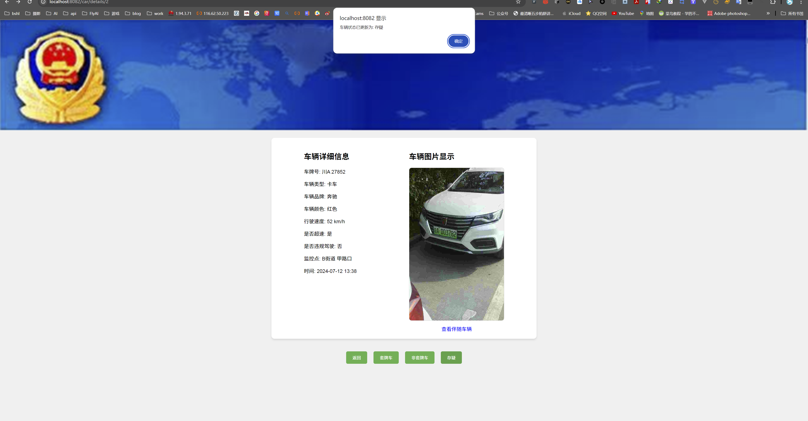

## 车辆套牌识别系统

该项目是基于 Spring Boot 框架开发的车辆信息管理系统，旨在实现对车辆数据的管理、状态更新以及伴随车辆的查询。系统通过 MyBatis
Plus 进行数据库操作，使用 Thymeleaf 实现前端页面展示，并支持车辆状态的更新和伴随车辆的查询功能。

### 联系方式（付费咨询）

- 微信：284190056
- QQ：284190056

### 项目图片

- 首页
  
- 详情
  
- 车辆状态更新
  
- 首页
  
- 可疑车辆更新
  

### 项目技术栈

- **Java 版本**: JDK 21
- **Spring Boot**: 3.3.3
- **MyBatis Plus**: 3.5.7
- **Thymeleaf**: 3.x
- **数据库**: MySQL 8.0.33
- **依赖管理**: Maven

### 项目功能

1. **车辆信息展示**：
    - 列表展示所有车辆的基本信息（如车牌号、车型、品牌、颜色、行驶速度、状态等）。

2. **车辆详情页面**：
    - 单独展示某一车辆的详细信息。
    - 显示该车辆的图片。
    - 通过按钮更新车辆的状态（套牌车、非套牌车、存疑）。

3. **伴随车辆查询**：
    - 在车辆详情页面，提供"查看伴随车辆"按钮，查询与当前车辆路口信息相同的其他车辆列表。
    - 在伴随车辆页面，可返回详情页面或首页。

4. **车辆状态更新**：
    - 支持车辆状态的修改，更新后的状态会立即在数据库中更新。
    - 对于标记为“套牌车”的车辆，系统会显示与该车辆同路口的其他可疑车辆。

### 主要依赖

- **Spring Boot Starter Web**: 提供Web应用开发的基本功能。
- **Spring Boot Starter Thymeleaf**: 用于集成 Thymeleaf 模板引擎。
- **Spring Boot Starter DevTools**: 提供开发时的热重载功能。
- **MyBatis Plus**: 简化与数据库的交互操作。
- **Lombok**: 简化 Java 对象中的代码，如 getter/setter 等（可选）。
- **MySQL Connector**: 连接 MySQL 数据库。

### 项目启动步骤

#### 1. 环境准备

- **JDK**: 安装 JDK 21 并配置 `JAVA_HOME` 环境变量。
- **MySQL**: 安装并启动 MySQL 数据库。
- **Maven**: 确保已安装并配置 Maven。

#### 2. 数据库配置

- 在 `src/main/resources/application.properties` 中设置 MySQL 数据库的连接信息：

```properties
spring.datasource.url=jdbc:mysql://localhost:3306/car?useUnicode=true&characterEncoding=UTF-8&serverTimezone=UTC
spring.datasource.username=你的数据库用户名
spring.datasource.password=你的数据库密码
spring.datasource.driver-class-name=com.mysql.cj.jdbc.Driver
```

- 创建数据库：
  执行以下 SQL 创建数据库和相关表：

```sql
CREATE
DATABASE car;
USE
car;

CREATE TABLE `car`
(
    `id`               bigint                          NOT NULL AUTO_INCREMENT COMMENT '主键，自动递增',
    `license_plate`    varchar(50) COLLATE utf8mb4_bin NOT NULL COMMENT '车牌号',
    `model`            varchar(50) COLLATE utf8mb4_bin  DEFAULT NULL COMMENT '车辆类型',
    `brand`            varchar(50) COLLATE utf8mb4_bin  DEFAULT NULL COMMENT '车辆品牌',
    `color`            varchar(20) COLLATE utf8mb4_bin  DEFAULT NULL COMMENT '车辆颜色',
    `speed`            int                              DEFAULT NULL COMMENT '行驶速度，单位：km/h',
    `over_speed`       tinyint(1) DEFAULT NULL COMMENT '是否超速',
    `illegal_driving`  tinyint(1) DEFAULT NULL COMMENT '是否违规驾驶',
    `monitoring_point` varchar(100) COLLATE utf8mb4_bin DEFAULT NULL COMMENT '监控点位置信息',
    `time`             datetime                         DEFAULT NULL COMMENT '检测时间',
    `status`           varchar(50) COLLATE utf8mb4_bin  DEFAULT NULL COMMENT '车辆状态 (可疑, 套牌车, 非套牌车, 存疑)',
    `img`              varchar(255) COLLATE utf8mb4_bin DEFAULT NULL COMMENT '车辆图片路径',
    `street`           varchar(100) COLLATE utf8mb4_bin DEFAULT NULL COMMENT '街道',
    `intersection`     varchar(100) COLLATE utf8mb4_bin DEFAULT NULL COMMENT '路口',
    PRIMARY KEY (`id`)
) ENGINE=InnoDB DEFAULT CHARSET=utf8mb4 COLLATE=utf8mb4_bin COMMENT='车辆信息表';
```

#### 3. 运行项目

- **克隆或下载项目源代码**：
  ```bash
  git clone https://github.com/your-repo/car.git
  cd car
  ```

- **通过 Maven 构建项目**：
  执行以下命令进行编译并打包项目：
  ```bash
  mvn clean package
  ```

- **运行项目**：
  在项目目录下执行：
  ```bash
  java -jar target/car-0.0.1-SNAPSHOT.jar
  ```

- **访问系统**：
  打开浏览器并访问以下地址：
  ```
  http://localhost:8082
  ```

#### 4. 图片存储说明

- 所有车辆的图片都存储在 `src/main/resources/static/images/car` 目录中。
- 图片命名格式为 `car1.png`、`car2.png` 等。

### 常见问题

1. **MySQL 连接失败**：
   确保 MySQL 服务已启动，并检查 `application.properties` 中的连接信息是否正确。

2. **Thymeleaf 页面渲染问题**：
   请确保模板文件夹 `src/main/resources/templates` 中存在所需的 `.html` 文件，如 `index.html` 和 `car-details.html`。

### 项目目录结构

```
src
├── main
│   ├── java
│   │   └── com.example.car  # 主要的Java代码
│   ├── resources
│   │   ├── static  # 静态资源文件夹
│   │   │   └── images
│   │   │       └── car  # 存储车辆图片
│   │   ├── templates  # Thymeleaf 模板页面
│   │   └── application.properties  # 项目配置文件
└── test
    └── java
``` 

### 版本信息

- **Spring Boot**: 3.3.3
- **MyBatis Plus**: 3.5.7
- **MySQL Connector**: 8.0.33
- **JDK**: 21

这就是车辆信息管理系统的基本介绍和启动步骤，帮助您快速部署和启动项目。